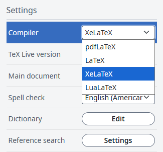

# Write Bangla in LaTeX

This guide demonstrates how to write Bangla (Bengali) in LaTeX.

## Prerequisites

- Use the **XeLaTeX** compiler (pdfLaTeX will not work for Bangla script)
- Install the **Bangla** Unicode font you want to use

> [!IMPORTANT]
> Use "XeLaTeX" compiler

## Change compiler to XeLaTeX

1. Go to **Menu** in your LaTeX editor. [Left corner]
2. Change the compiler from the default **pdfLaTeX** to **XeLaTeX**.



## Package

```latex
\usepackage{fontspec}
% Set Bangla font
\newfontfamily\bangla[Script=Bengali]{Noto Serif Bengali}
% I've used "Noto Serif Bangali" font
```

## Download Font

If you wanna use [🔗Noto Serif Bangali](https://fonts.google.com/noto/specimen/Noto+Serif+Bengali?query=bangla)


## Troubleshooting

- **Bangla text not showing?**  
  Ensure you are compiling with XeLaTeX, not pdfLaTeX.

- **Font not found error?**  
  Make sure the font is installed on your system and the font name matches exactly.
