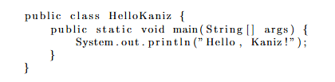
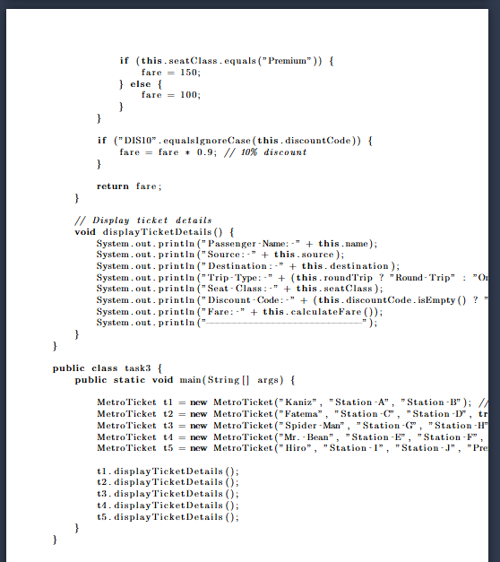

# Code Listing

LaTeX is widely used in science, and programming has become an important part of many scientific fields. Because of that, clear code formatting in documents is essential. This guide shows a few common ways to include code in LaTeX.

## The verbatim environment

```latex
\begin{verbatim}
Text enclosed inside \texttt{verbatim} environment 
is printed directly 
and all \LaTeX{} commands are ignored.
\end{verbatim}
```
The code above produces the following output:


## Using listings to highlight code
Add the following line to the preamble of your document:

```latex
\usepackage{listings}
```
Here's an example of using the lstlisting environment from the listings package:
```latex
\begin{lstlisting}
public class HelloWorld {
    public static void main(String[] args) {
        System.out.println("Hello, Kaniz!");
    }
}
\end{lstlisting}
```


The code above produces the following output:



## Importing code from a file
Add the following line to the preamble of your document:

```latex
\usepackage{listings}
```
Code is usually stored in a source file, therefore a command that automatically pulls code from a file becomes very handy.

```latex
\lstinputlisting[language=Java]
{HelloKaniz.java}
```

> [!CAUTION]
> While using **“Importing code from a file”** with `\lstinputlisting`, you may encounter line-breaking or spacing issues.



> [!TIP]
> To resolve this, add the following configuration **immediately after** `\usepackage{listings}`.

**Normal font size**
```latex
\lstset{
  basicstyle=\ttfamily\normalsize,
  breaklines=true,
  breakatwhitespace=true,
  columns=fullflexible,
  keepspaces=true,
  showstringspaces=false
}
```
**Large font size**
```latex
\lstset{
  basicstyle=\ttfamily\large,
  breaklines=true,
  breakatwhitespace=true,
  columns=fullflexible,
  keepspaces=true,
  showstringspaces=false
}
```

## Super fancy code

To get code that looks like your screenshot (syntax colors + line numbers + top/bottom rules + “Listing 1: …” caption), use the minted package.

**1) Preamble:**
```latex
\usepackage[newfloat]{minted} % provides the listing float
\usepackage{float}            % for [H]
\usemintedstyle{friendly}

\setminted{
  linenos,
  frame=lines,
  breaklines,
  fontsize=\small,
  numbersep=6pt,
  framesep=2mm,
  tabsize=2
}
```
**2) In the document:**
```latex
\begin{listing}[H]
\begin{minted}{java}
// A comment
public class HelloWorld {
    public static void main(String[] args) {
        System.out.println("Hello, Kaniz!");
    }
}
\end{minted}
\caption{Super fancy code}
\end{listing}

```

The code above produces the following output:


## Super fancy code while importing code from file
**1) Preamble:**
```latex
\usepackage[newfloat]{minted} % provides the listing float
\usepackage{float}            % for [H]
\usemintedstyle{friendly}
\usepackage{needspace}
\usepackage{caption}

\setminted{
  linenos,
  frame=lines,
  breaklines,
  fontsize=\small,
  numbersep=6pt,
  framesep=2mm,
  tabsize=2
}
```
**2) In the document:**
```latex
\begin{listing}[H]
\inputminted{java}{task1.java}
\caption{Task 1: Print Hello World}
\end{listing}
```

> [!TIP]
> If you want Output to look like minted too.

```latex
% Write in document
\subsubsection{Solution}
\Needspace{12\baselineskip}
\inputminted{java}{task1.java}
\captionof{listing}{Task 1: Print "Hello Kaniz"}

\Needspace{10\baselineskip}
\section*{Output}
\begin{minted}{text}
Name: Hello Kaniz!
\end{minted}
```


## 📎Resources
To learn more
- [Code listing](https://www.overleaf.com/learn/latex/Code_listing) 